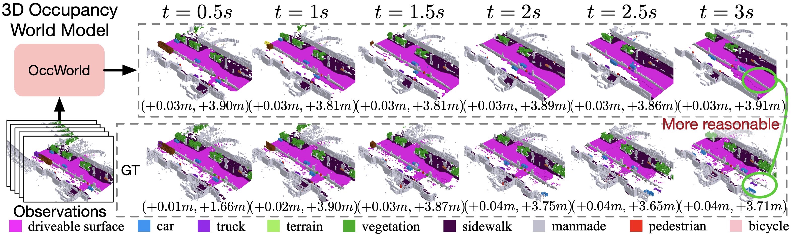

# OccWorld
### [Paper](https://arxiv.org/pdf/2311.16038) | [Project Page](https://wzzheng.net/OccWorld/) 

> OccWorld: Learning a 3D Occupancy World Model for Autonomous Driving

> [Wenzhao Zheng](https://wzzheng.net/)\*, [Weiliang Chen](https://github.com/chen-wl20)\*, [Yuanhui Huang](https://scholar.google.com/citations?hl=zh-CN&user=LKVgsk4AAAAJ), [Borui Zhang](https://boruizhang.site/), [Yueqi Duan](https://duanyueqi.github.io/), [Jiwen Lu](http://ivg.au.tsinghua.edu.cn/Jiwen_Lu/)

\* Equal contribution

## News

- **[2023/12/7]** We update the code and config files for OccWorld. 

**OccWorld models the joint evolutions of 3D scenes and ego movements.**

Combined with self-supervised ([SelfOcc](https://github.com/huang-yh/SelfOcc)), LiDAR-collected ([TPVFormer](https://github.com/wzzheng/TPVFormer)), or machine-annotated ([SurroundOcc](https://github.com/weiyithu/SurroundOcc))  3D occupancy, OccWorld has the potential to scale up to large-scale training, paving the way for **interpretable end-to-end large driving models**.

## Demo


## Overview



Given past 3D occupancy observations, our self-supervised OccWorld trained can forecast future scene evolutions and ego movements jointly. This task requires a spatial understanding of the 3D scene and temporal modeling of how driving scenarios develop. We observe that OccWorld can successfully forecast the movements of surrounding agents and future map elements such as drivable areas. OccWorld even generates more reasonable drivable areas than the ground truth, demonstrating its ability to understand the scene rather than memorizing training data. Still, it fails to forecast new vehicles entering the sight, which is difficult given their absence in the inputs. 


## Installation
1. Create conda environment with python version 3.8.0

2. Install all the packages in environment.yaml

3. Anything about the installation of mmdetection3d, please refer to [mmdetection3d](https://mmdetection3d.readthedocs.io/en/latest/getting_started.html#installation)

## Preparing
1. Create soft link from data/nuscenes to your_nuscenes_path

2. Prepare the gts semantic occupancy introduced in [Occ3d](https://github.com/Tsinghua-MARS-Lab/Occ3D)

3. Download our generated train/val pickle files and put them in data/

    [nuscenes_infos_train_temporal_v3_scene.pkl](https://cloud.tsinghua.edu.cn/d/9e231ed16e4a4caca3bd/)

    [nuscenes_infos_val_temporal_v3_scene.pkl](https://cloud.tsinghua.edu.cn/d/9e231ed16e4a4caca3bd/)

  The dataset should be organized as follows:

```
OccWorld/data
    nuscenes                 -    downloaded from www.nuscenes.org
        lidarseg
        maps
        samples
        sweeps
        v1.0-trainval
        gts                  -    download from Occ3d
    nuscenes_infos_train_temporal_v3_scene.pkl
    nuscenes_infos_val_temporal_v3_scene.pkl
```

## Getting Started

### Training
Train the VQVAE on RTX 4090 with 24G GPU memory.
```
python train.py --py-config config/train_vqvae.py --work-dir out/vqvae
```
Train the OccWorld on RTX 4090 with 24G GPU memory. (Remember to change the checkpoint path of VQVAE in the config file)
```
python train.py --py-config config/train_occworld.py --work-dir out/occworld
```
### Evaluation
Eval the model on RTX 4090 with 24G GPU memory. (Remember to change the checkpoint path of OccWorld in the config file)
```
python eval_metric_stp3.py --py-config config/occworld.py --work-dir out/occworld
```
## Related Projects

Our code is based on [TPVFormer](https://github.com/wzzheng/TPVFormer), [SelfOcc](https://github.com/huang-yh/SelfOcc), and [PointOcc](https://github.com/wzzheng/PointOcc). 

Also thanks to these excellent open-sourced repos:
[SurroundOcc](https://github.com/weiyithu/SurroundOcc) 
[OccFormer](https://github.com/zhangyp15/OccFormer)
[BEVFormer](https://github.com/fundamentalvision/BEVFormer)

## Citation

If you find this project helpful, please consider citing the following paper:
```
@article{zheng2023occworld,
    title={OccWorld: Learning a 3D Occupancy World Model for Autonomous Driving},
    author={Zheng, Wenzhao and Chen, Weiliang and Huang, Yuanhui and Zhang, Borui and Duan, Yueqi and Lu, Jiwen },
    journal={arXiv preprint arXiv: 2311.16038},
    year={2023}
}
```
